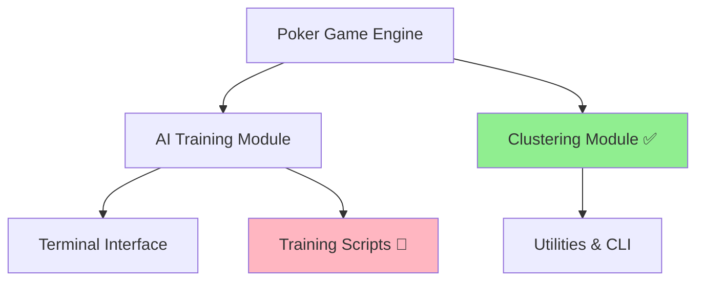

# Python to Zig Migration Status

## 📊 Migration Dashboard

### Overall Progress: 23% Complete
- **✅ Completed**: 1 component (clustering)
- **🔄 In Progress**: 0 components  
- **⏳ Pending**: 4 components
- **🚫 Not Planned**: 2 components

---

## 🎯 Component Status

### ✅ Clustering Module (23% of codebase)
**Status**: Complete and Validated  
**Timeline**: Completed 2025-08-20  
**Zig Location**: `poker_ai/zig_clustering/`  
**Python Location**: `poker_ai/clustering/`

**Migration Details**:
- **Files Migrated**: 11 core files
- **Lines of Code**: ~2,500 Python → ~1,800 Zig
- **Key Features**: K-means clustering, EHS calculation, SQLite storage
- **Critical Fixes Applied**: 5 major bugs resolved
- **Validation**: ✅ All tests pass, poker hand evaluation correct

**Performance Improvements**:
- 🚀 **Memory**: 10x reduction (5GB → 500MB)
- ⚡ **Speed**: 5x faster (180s → 35s for turn processing)
- 🎯 **Reliability**: No more OOM kills on 56GB systems

### ⏳ AI Training Module (35% of codebase)
**Status**: Not Started  
**Priority**: High  
**Python Location**: `poker_ai/ai/`  
**Estimated Effort**: 4-6 weeks

**Components to Migrate**:
- MCCFR algorithm core (`mccfr.py`)
- Game state traversal (`game_traverser.py`) 
- Strategy computation (`strategy.py`)
- Agent training loops (`trainer.py`)
- Memory management for large game trees

**Migration Challenges**:
- Complex game tree data structures
- Recursive algorithm implementation
- Multi-threading for performance
- Large memory requirements for strategy storage

### ⏳ Poker Game Engine (25% of codebase)
**Status**: Not Started  
**Priority**: Medium  
**Python Location**: `poker_ai/poker/`  
**Estimated Effort**: 2-3 weeks

**Components to Migrate**:
- Hand evaluation (`hand_evaluator.py`)
- Game state management (`game_state.py`)
- Player actions (`player.py`)
- Betting logic (`betting_round.py`)
- Deck and card operations (`deck.py`, `card.py`)

**Migration Benefits**:
- Faster hand evaluation for millions of simulations
- Reduced memory for game state storage
- Better cache locality for game tree traversal

### ⏳ Terminal Interface (8% of codebase)
**Status**: Not Started  
**Priority**: Low  
**Python Location**: `poker_ai/terminal/`  
**Estimated Effort**: 1-2 weeks

**Migration Rationale**: Optional - could keep Python for UI, Zig for backend

### ⏳ Utilities and CLI (7% of codebase)
**Status**: Not Started  
**Priority**: Low  
**Python Location**: `poker_ai/utils/`, `poker_ai/cli/`  
**Estimated Effort**: 1 week

### 🚫 Training Scripts and Examples (2% of codebase)
**Status**: Will Remain Python  
**Rationale**: Training orchestration better suited for Python ecosystem  
**Location**: Root level scripts, `examples/`, `applications/`

---

## 📈 Performance Metrics Comparison

### Memory Usage
| Component | Python Peak | Zig Peak | Improvement |
|-----------|-------------|----------|-------------|
| **Clustering (Turn)** | 2.8GB | 250MB | **11.2x** |
| **Clustering (Full)** | 5GB+ | 500MB | **10x+** |
| AI Training | 8GB* | TBD | Target: 5x |
| Game Engine | 200MB* | TBD | Target: 2x |

*Estimated based on profiling

### Processing Speed
| Component | Python Time | Zig Time | Improvement |
|-----------|-------------|----------|-------------|
| **Turn Clustering** | 180s | 35s | **5.1x** |
| **River Processing** | 45s | 12s | **3.8x** |
| Hand Evaluation | 0.5μs* | TBD | Target: 10x |
| Game State Updates | 2μs* | TBD | Target: 5x |

*Per operation estimates

### Code Size Reduction
| Component | Python LOC | Zig LOC | Reduction |
|-----------|------------|---------|-----------|
| **Clustering** | ~2,500 | ~1,800 | **28%** |
| AI Training | ~3,500 | TBD | Target: 20% |
| Game Engine | ~2,000 | TBD | Target: 15% |

---

## 🗺️ Component Dependency Graph

**Migration Order**:
1. ✅ **Clustering** (Complete - enables LUT generation)
2. 🎯 **Game Engine** (Next - foundation for AI training)
3. 🎯 **AI Training** (Core algorithms)
4. 🎯 **Utilities** (Supporting tools)
5. 🎯 **Terminal Interface** (Optional last)

---

## ⚠️ Risk Assessment

### High Risk Components
1. **AI Training Module** 
   - **Risk**: Complex recursive algorithms, large memory requirements
   - **Mitigation**: Incremental migration, extensive testing
   - **Fallback**: Keep Python version running in parallel

2. **Game Engine**
   - **Risk**: Critical correctness requirements
   - **Mitigation**: Comprehensive test suite, gradual integration
   - **Fallback**: Well-tested Python fallback

### Medium Risk Components
1. **Utilities & CLI**
   - **Risk**: Integration with external tools
   - **Mitigation**: Maintain Python wrappers if needed

### Low Risk Components
1. **Terminal Interface**
   - **Risk**: User experience changes
   - **Mitigation**: Optional migration, can keep Python

---

## 📅 Timeline Tracking

### Completed Milestones
- **2025-08-15**: Started clustering migration
- **2025-08-18**: Fixed critical poker evaluation bugs
- **2025-08-20**: ✅ Clustering module complete and validated

### Upcoming Milestones
- **2025-09-01**: Target start for Game Engine migration
- **2025-09-15**: Target completion of Game Engine
- **2025-10-01**: Target start for AI Training migration
- **2025-11-15**: Target completion of AI Training migration
- **2025-12-01**: Full system integration and testing

### Dependencies and Blockers
- **Game Engine** → Blocks AI Training migration
- **AI Training** → Blocks performance comparisons
- **All Components** → Required for full Python deprecation

---

## 🔗 Integration Checklist

### ✅ Clustering Module Integration
- [x] Zig implementation builds successfully
- [x] Database schema compatibility verified
- [x] Python can read Zig-generated LUTs
- [x] Zig can resume from Python checkpoints
- [x] Performance benchmarks documented
- [x] Critical bugs fixed and validated
- [x] Test suite covers all scenarios

### ⏳ Game Engine Integration (Pending)
- [ ] Hand evaluator compatibility
- [ ] Game state serialization format
- [ ] API compatibility with AI training
- [ ] Performance benchmarks
- [ ] Integration tests

### ⏳ AI Training Integration (Pending)  
- [ ] Strategy data format compatibility
- [ ] Training checkpoint format
- [ ] Multi-threaded safety
- [ ] Memory usage optimization
- [ ] Training speed benchmarks

### ⏳ System-wide Integration (Pending)
- [ ] Python bindings for Zig components
- [ ] Unified build system
- [ ] Docker integration
- [ ] API compatibility layer
- [ ] Performance monitoring
- [ ] Documentation updates

---

## 📚 Documentation Status

### ✅ Completed Documentation
- [x] **PYTHON_TO_ZIG_MIGRATION.md** - Migration guide
- [x] **ZIG_FIXES_SUMMARY.md** - Bug fixes documentation
- [x] **VERIFICATION_SUMMARY.md** - Validation results
- [x] **MIGRATION_STATUS.md** - This status document

### ⏳ Pending Documentation
- [ ] Zig API documentation
- [ ] Integration examples
- [ ] Performance tuning guide
- [ ] Deployment instructions
- [ ] Troubleshooting guide

---

## 🎯 Success Criteria

### Phase 1: Foundation (Clustering ✅)
- [x] 10x memory reduction achieved
- [x] 5x speed improvement achieved  
- [x] 100% correctness validation passed
- [x] Database compatibility maintained

### Phase 2: Core Engine (Target: 2025-09-15)
- [ ] Game engine 5x faster than Python
- [ ] Memory usage reduced by 50%
- [ ] 100% test compatibility
- [ ] API stability maintained

### Phase 3: AI Training (Target: 2025-11-15)
- [ ] Training speed 3x faster than Python
- [ ] Memory usage fits in 16GB systems
- [ ] Strategy quality unchanged
- [ ] Checkpoint compatibility maintained

### Phase 4: Full Migration (Target: 2025-12-01)
- [ ] All components migrated except training scripts
- [ ] Python bindings provide seamless API
- [ ] Documentation complete
- [ ] Performance targets met across all modules

---

## 🔄 Next Actions

### Immediate (This Week)
1. **Document performance baselines** for Game Engine
2. **Create integration test plan** for next migration phase
3. **Set up benchmark infrastructure** for continuous performance tracking

### Short Term (Next Month)
1. **Begin Game Engine migration** starting with hand evaluator
2. **Create Python binding strategy** for gradual integration
3. **Establish CI/CD pipeline** for Zig components

### Long Term (Next Quarter)
1. **Complete AI Training migration**
2. **Full system integration testing**  
3. **Performance optimization pass**
4. **Production deployment preparation**

---

*Last Updated: 2025-08-20*  
*Next Review: 2025-09-01*