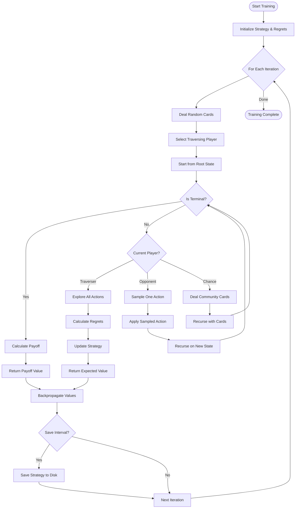

# System Architecture Diagrams

## Overall System Architecture

```
┌─────────────────────────────────────────────────────────────────┐
│                         POKER AI SYSTEM                          │
├─────────────────────────────────────────────────────────────────┤
│                                                                   │
│  ┌──────────────┐  ┌──────────────┐  ┌──────────────┐          │
│  │   CLI Layer  │  │ Terminal UI  │  │   Web Viz    │          │
│  │  (runner.py) │  │   (play)     │  │    (viz)     │          │
│  └──────┬───────┘  └──────┬───────┘  └──────┬───────┘          │
│         │                  │                  │                  │
│         └──────────────────┼──────────────────┘                  │
│                            ▼                                     │
│  ┌────────────────────────────────────────────────────────┐     │
│  │                    GAME ENGINE                          │     │
│  │  ┌────────────┐  ┌────────────┐  ┌────────────┐       │     │
│  │  │   State    │  │   Table    │  │    Pot     │       │     │
│  │  │  Manager   │  │  Manager   │  │  Manager   │       │     │
│  │  └────────────┘  └────────────┘  └────────────┘       │     │
│  │  ┌────────────┐  ┌────────────┐  ┌────────────┐       │     │
│  │  │   Deck     │  │   Player   │  │ Evaluator  │       │     │
│  │  │            │  │            │  │            │       │     │
│  │  └────────────┘  └────────────┘  └────────────┘       │     │
│  └────────────────────────────────────────────────────────┘     │
│                            ▼                                     │
│  ┌────────────────────────────────────────────────────────┐     │
│  │                      AI SYSTEM                          │     │
│  │  ┌────────────┐  ┌────────────┐  ┌────────────┐       │     │
│  │  │   MCCFR    │  │  Strategy  │  │   Agent    │       │     │
│  │  │  Algorithm │  │   Storage  │  │  Interface │       │     │
│  │  └────────────┘  └────────────┘  └────────────┘       │     │
│  │  ┌────────────┐  ┌────────────┐                        │     │
│  │  │   Multi-   │  │   Single-  │                        │     │
│  │  │  Process   │  │   Process  │                        │     │
│  │  └────────────┘  └────────────┘                        │     │
│  └────────────────────────────────────────────────────────┘     │
│                            ▼                                     │
│  ┌────────────────────────────────────────────────────────┐     │
│  │                   CLUSTERING SYSTEM                     │     │
│  │  ┌────────────┐  ┌────────────┐  ┌────────────┐       │     │
│  │  │   LUT      │  │  K-Means   │  │   Equity   │       │     │
│  │  │  Builder   │  │ Clustering │  │ Calculator │       │     │
│  │  └────────────┘  └────────────┘  └────────────┘       │     │
│  └────────────────────────────────────────────────────────┘     │
│                                                                   │
└─────────────────────────────────────────────────────────────────┘
```

## MCCFR Training Flow



## Game State Transitions

```
                          NEW GAME
                              │
                              ▼
                    ┌─────────────────┐
                    │   POST BLINDS   │
                    └────────┬────────┘
                              │
                              ▼
                    ┌─────────────────┐
                    │  DEAL HOLE CARDS│
                    └────────┬────────┘
                              │
                              ▼
        ┌─────────────────────────────────────────┐
        │              PREFLOP BETTING            │
        │  ┌──────┐  ┌──────┐  ┌──────┐         │
        │  │ Fold │  │ Call │  │ Raise │         │
        │  └──────┘  └──────┘  └──────┘         │
        └────────────────┬────────────────────────┘
                         │
                         ▼
                   All Fold?────Yes───→ WINNER
                         │
                        No
                         │
                         ▼
                  ┌────────────┐
                  │ DEAL FLOP  │ (3 cards)
                  └─────┬──────┘
                        │
                        ▼
                  FLOP BETTING
                        │
                        ▼
                  All Fold?────Yes───→ WINNER
                        │
                       No
                        │
                        ▼
                  ┌────────────┐
                  │ DEAL TURN  │ (1 card)
                  └─────┬──────┘
                        │
                        ▼
                  TURN BETTING
                        │
                        ▼
                  All Fold?────Yes───→ WINNER
                        │
                       No
                        │
                        ▼
                  ┌────────────┐
                  │ DEAL RIVER │ (1 card)
                  └─────┬──────┘
                        │
                        ▼
                  RIVER BETTING
                        │
                        ▼
                  All Fold?────Yes───→ WINNER
                        │
                       No
                        │
                        ▼
                  ┌────────────┐
                  │  SHOWDOWN   │
                  └─────┬──────┘
                        │
                        ▼
                  ┌────────────┐
                  │ EVALUATE    │
                  │   HANDS     │
                  └─────┬──────┘
                        │
                        ▼
                  ┌────────────┐
                  │ DISTRIBUTE  │
                  │    POT      │
                  └─────┬──────┘
                        │
                        ▼
                     GAME END
```

## Clustering Pipeline

```
┌─────────────────────────────────────────────────────┐
│                 LUT GENERATION PIPELINE              │
└─────────────────────────────────────────────────────┘
                           │
                           ▼
        ┌──────────────────────────────────┐
        │      1. PREFLOP CLUSTERING        │
        │         (169 clusters)            │
        │      ┌──────────────────┐        │
        │      │ Rank combinations│        │
        │      │ Suited/Offsuit   │        │
        │      │ Pocket pairs     │        │
        │      └──────────────────┘        │
        └─────────────┬────────────────────┘
                      │ ~1 minute
                      ▼
        ┌──────────────────────────────────┐
        │      2. RIVER CLUSTERING          │
        │      (200-500 clusters)           │
        │      ┌──────────────────┐        │
        │      │ Sample 2.6B combos│        │
        │      │ Compute hand str  │        │
        │      │ K-means clustering│        │
        │      └──────────────────┘        │
        └─────────────┬────────────────────┘
                      │ ~30 minutes
                      ▼
        ┌──────────────────────────────────┐
        │       3. TURN CLUSTERING          │
        │      (200-500 clusters)           │
        │      ┌──────────────────┐        │
        │      │ Sample 305M combos│        │
        │      │ Compute equity    │        │
        │      │ Consider outs     │        │
        │      │ K-means clustering│        │
        │      └──────────────────┘        │
        └─────────────┬────────────────────┘
                      │ ~20 minutes
                      ▼
        ┌──────────────────────────────────┐
        │       4. FLOP CLUSTERING          │
        │      (200-500 clusters)           │
        │      ┌──────────────────┐        │
        │      │ Sample 26M combos │        │
        │      │ Compute potential │        │
        │      │ Texture features  │        │
        │      │ K-means clustering│        │
        │      └──────────────────┘        │
        └─────────────┬────────────────────┘
                      │ ~40 minutes
                      ▼
        ┌──────────────────────────────────┐
        │        5. SAVE LUT FILE           │
        │    card_info_lut.joblib           │
        │        (300-400 MB)               │
        └───────────────────────────────────┘
```

## Information Set Mapping

```
Game State                    Info Set Components              Clustered Info Set
─────────────────────────────────────────────────────────────────────────────────
                                    
Player: 0                          ┌─────────────┐
Cards: A♠ K♠         ─────────→   │  Preflop    │
Board: []                          │  Cluster    │──────→ "cluster_15"
                                   │  (AKs→15)   │
                                   └─────────────┘

Player: 0                          ┌─────────────┐
Cards: A♠ K♠         ─────────→   │    Flop     │
Board: Q♦ J♣ 10♠                  │  Cluster    │──────→ "cluster_15|cluster_201"
                                   │  (QJT→201)  │
                                   └─────────────┘
                                          +
                                   ┌─────────────┐
History:              ─────────→   │   Betting   │
P1-raise-300                       │  Abstract   │──────→ "cluster_15|cluster_201|R300"
P2-call-300                        │  (R300)     │
                                   └─────────────┘
```

## Strategy Storage Structure

```
┌────────────────────────────────────────────────┐
│            STRATEGY DICTIONARY                   │
├────────────────────────────────────────────────┤
│                                                  │
│  InfoSet_1 ──→ {"fold": 0.2,                   │
│                 "call": 0.5,                    │
│                 "raise": 0.3}                   │
│                                                  │
│  InfoSet_2 ──→ {"fold": 0.0,                   │
│                 "call": 0.8,                    │
│                 "raise": 0.2}                   │
│                                                  │
│  InfoSet_3 ──→ {"fold": 0.7,                   │
│                 "call": 0.3,                    │
│                 "raise": 0.0}                   │
│                                                  │
│  ...                                             │
│                                                  │
│  InfoSet_N ──→ {"fold": 0.1,                   │
│                 "call": 0.4,                    │
│                 "raise": 0.5}                   │
│                                                  │
└────────────────────────────────────────────────┘
                         │
                         ▼
                  ┌────────────┐
                  │  Compress  │
                  │   (gzip)   │
                  └─────┬──────┘
                        │
                        ▼
              offline_strategy.pkl.gz
                  (50-200 MB)
```

## Multiprocess Training Architecture

```
┌─────────────────────────────────────────────────────────┐
│                    MAIN PROCESS                          │
│  ┌─────────────────────────────────────────────────┐   │
│  │          Strategy Manager (Shared Memory)        │   │
│  └─────────────────────────────────────────────────┘   │
└─────────────┬───────────────────────────┬───────────────┘
              │                           │
              ▼                           ▼
┌──────────────────────┐      ┌──────────────────────┐
│     WORKER 1         │      │     WORKER 2         │
│  ┌────────────────┐  │      │  ┌────────────────┐  │
│  │  MCCFR Loop    │  │      │  │  MCCFR Loop    │  │
│  │  Iterations    │  │      │  │  Iterations    │  │
│  │  1-50,000      │  │      │  │  50,001-100,000│  │
│  └────────────────┘  │      │  └────────────────┘  │
│  ┌────────────────┐  │      │  ┌────────────────┐  │
│  │ Local Regrets  │  │      │  │ Local Regrets  │  │
│  └────────────────┘  │      │  └────────────────┘  │
└──────────┬───────────┘      └───────────┬──────────┘
           │                               │
           └───────────┬───────────────────┘
                       ▼
           ┌───────────────────────┐
           │   Synchronization     │
           │   Every 1000 iters    │
           └───────────────────────┘
```

## Hand Evaluation Pipeline

```
Input: 7 cards (2 hole + 5 community)
                │
                ▼
    ┌───────────────────────┐
    │  Generate C(7,5) = 21  │
    │    5-card combos       │
    └──────────┬────────────┘
                │
                ▼
    ┌───────────────────────┐
    │   For each combo:      │
    │   1. Check flush       │
    │   2. Check straight    │
    │   3. Count ranks       │
    └──────────┬────────────┘
                │
                ▼
    ┌───────────────────────┐
    │   Classify hand:       │
    │   - Royal flush        │
    │   - Straight flush     │
    │   - Four of a kind     │
    │   - Full house         │
    │   - Flush              │
    │   - Straight           │
    │   - Three of a kind    │
    │   - Two pair           │
    │   - One pair           │
    │   - High card          │
    └──────────┬────────────┘
                │
                ▼
    ┌───────────────────────┐
    │  Compute hand value:   │
    │  Category * 10^10 +    │
    │  Rank values           │
    └──────────┬────────────┘
                │
                ▼
    ┌───────────────────────┐
    │   Return best of 21    │
    │      combinations       │
    └───────────────────────┘
```

## Memory Layout During Training

```
┌─────────────────────────────────────────────────┐
│                  SYSTEM MEMORY                    │
├─────────────────────────────────────────────────┤
│                                                   │
│  ┌───────────────────────────────────────────┐  │
│  │         LUT (400 MB)                       │  │
│  │  • Preflop: 169 entries                   │  │
│  │  • River: 2.6M entries                    │  │
│  │  • Turn: 300K entries                     │  │
│  │  • Flop: 155K entries                     │  │
│  └───────────────────────────────────────────┘  │
│                                                   │
│  ┌───────────────────────────────────────────┐  │
│  │      STRATEGY DICT (1-5 GB)                │  │
│  │  • Info sets: 1-10M entries               │  │
│  │  • Actions: 2-5 per info set              │  │
│  │  • Probabilities: float32                 │  │
│  └───────────────────────────────────────────┘  │
│                                                   │
│  ┌───────────────────────────────────────────┐  │
│  │       REGRETS DICT (2-8 GB)                │  │
│  │  • Cumulative regrets                     │  │
│  │  • Per action, per info set               │  │
│  │  • Updated every iteration                │  │
│  └───────────────────────────────────────────┘  │
│                                                   │
│  ┌───────────────────────────────────────────┐  │
│  │    GAME STATES (100-500 MB)                │  │
│  │  • Active states in traversal             │  │
│  │  • Temporary, garbage collected           │  │
│  └───────────────────────────────────────────┘  │
│                                                   │
│  Total: 3-14 GB depending on iterations          │
│                                                   │
└─────────────────────────────────────────────────┘
```

## Bet Sizing Abstraction

```
Actual Bet Sizes              Abstracted Categories
────────────────────────────────────────────────────
                                    
$0 (Check)         ─────→     CHECK
                                    
$100 (Min bet)     ─────→     MIN_BET
                                    
$150-$300          ─────→     SMALL (0.3-0.5 pot)
                                    
$301-$600          ─────→     MEDIUM (0.5-1.0 pot)
                                    
$601-$1200         ─────→     LARGE (1.0-2.0 pot)
                                    
$1201+             ─────→     OVERBET (2.0+ pot)
                                    
All chips          ─────→     ALL_IN
```

## Performance Metrics Flow

```
Training Start
      │
      ▼
┌─────────────┐
│ Iteration 0 │
└──────┬──────┘
       │
       ▼
   Measure:
   • Time/iteration
   • Memory usage
   • Info sets visited
       │
       ▼
┌─────────────┐
│   Every     │
│ 1000 iters  │
└──────┬──────┘
       │
       ▼
   Calculate:
   • Average time
   • Strategy size
   • Convergence rate
       │
       ▼
┌─────────────┐
│   Display   │
│  Progress   │
└──────┬──────┘
       │
       ▼
  Continue or
   Complete
```